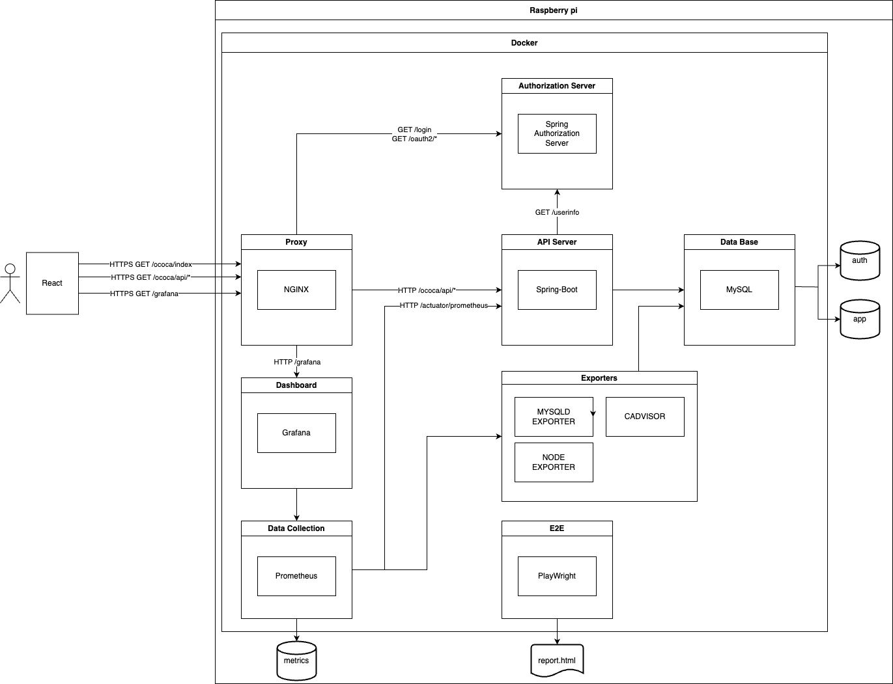
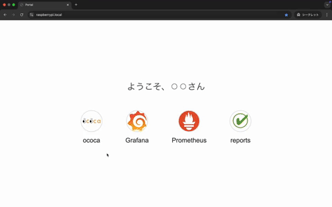
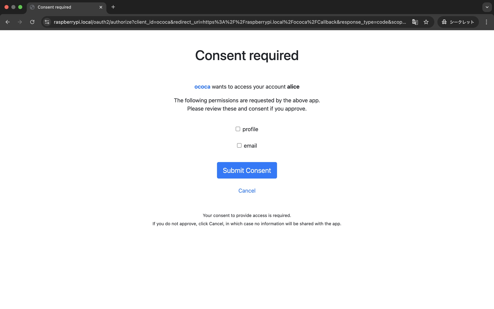
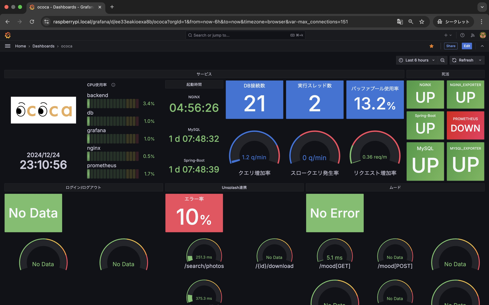

### サーバ構築およびサービス立ち上げの自動化デモ

raspberry piをサーバ化する処理をAnsibleで自動化しました。  
また、サービスの環境構築はDockerで自動化しました。  

docker-composeで以下のサービスが立ち上がり常駐します。  
- ムードトラッキングアプリ(React)
    - [ソースコード](https://github.com/YuuNozawa/ococa-frontend)
- 日めくりカウンドダウンアプリ(RoR)
    - [ソースコード](https://github.com/YuuNozawa/countdown-app)
- APIサーバ(Spring-Boot)
    - [ソースコード](https://github.com/YuuNozawa/ococa-backend)
- 認可サーバ(Spring Authorization Server)
    - [ソースコード](https://github.com/YuuNozawa/auth-server)
- データベース(MySQL)
- Grafana
- PrometheusおよびExporter

サービスは以下を実装しています。  
- SSL/TLS(自己署名証明書)
- OIDC
- Restful API
- SPA,PWA
- E2Eテストの自動化とレポート作成

以下は実装予定です。  
- SSO
- CI/CD

### 構成図 
  

### OIDC

### 監視
  
  
